

  

Not just a typical job board app!

**JeffreyWoo CareerHub** is an AI-powered career consultancy and talent acquisition platform designed to help job seekers and employers connect meaningfully. By combining intelligent search, resume analysis, and personalized career guidance, it empowers users to take control of their professional journey.

## 🌍 Workforce Impact
**JeffreyWoo CareerHub** is a strategic workforce solution:  
- Reduce hiring friction and time-to-fill  
- Improve candidate-job fit with AI matching  
- Enhance employer branding and engagement  
- Support sustainable career growth and retention

## ✨ What Makes It Different
Most platforms just list jobs. CareerHub goes further:  
- 🔍 **Smart Job Search** — filter by title, location, salary, industry, and job type  
- 📌 **Saved Jobs & Searches** — bookmark opportunities and revisit with ease  
- 📈 **Application History** — track submissions and follow up intelligently  
- 🧠 **Career Coaching Tools** — resume tips, interview prep, and growth strategies  
- 🏢 **Company Hub** — transparency with About Us, Contact, and Privacy Policy
- 📄 **Web Policy** — clear and accessible Terms of Service & Cookie Policy for user trust and compliance

## 🚀 Why Choose JeffreyWoo CareerHub
Whether you're exploring new roles or hiring top talent, **JeffreyWoo CareerHub** is your AI-powered partner for career success. It’s fast, intuitive, and built for real-world hiring needs.

## 📦 Getting Started
1. 	Search for jobs using filters or keywords  
2. 	Save jobs and track applications  
3. 	Use coaching tools to refine your resume and interview skills  
4. 	Connect with companies and explore their profiles

## 🤖 Tech Stack
- **Language** — TypeScript, HTML  
- **Framework** — Node.js / Express  
- **Database** — MongoDB / Firebase  
- **AI Integration** — Google Gemini API (Flash & Pro models)  
- **Deployment** — Cloud-ready, secure, and scalable

## 🧠 Career Matching Logic
- **Resume Parsing & Keyword Matching**  
Uses Natural Language Processing (NLP) to extract skills, experience, and match with job descriptions  
- **Job Fit Scoring**  
Calculates compatibility based on role requirements, location, and user preferences  
- **Application Tracking**  
Logs submission dates, statuses, and reminders for follow-up  
- **Behavioral Insights**  
Suggests roles based on browsing history, saved jobs, and interaction patterns

## 💡 Transformation Impact
This project demonstrates how AI can reshape career development:  
- Digitizing job search and recruitment workflows  
- Empowering users with personalized career insights  
- Enhancing transparency between candidates and employers  
- Driving smarter hiring decisions with data-backed matching  
- Promoting inclusive and sustainable career growth

## ⭐ Skills Strengthened
- Full-stack architecture for career platforms  
- AI integration for resume parsing and job matching  
- Secure handling of user data and application history  
- Scalable backend with Express and MongoDB  
- User Interface (UI) / User Experience (UX) design for intuitive job search and tracking

## ⚖️ Disclaimer
**JeffreyWoo CareerHub** provides AI-driven career insights for informational purposes only. It does not guarantee job placement or hiring outcomes. For personalized career guidance, please consult qualified human resources professionals, recruiters, headhunters, or certified career advisors.

## ⚙️ Run Locally
**Prerequisites:** Node.js

1. 	Install dependencies:  
      `npm install`  
3. 	Set the `GEMINI_API_KEY` in [.env.local](.env.local) file after you create [.env.local](.env.local) file  
4. 	Run the app:  
      `npm run dev`

## 📋 Sample

  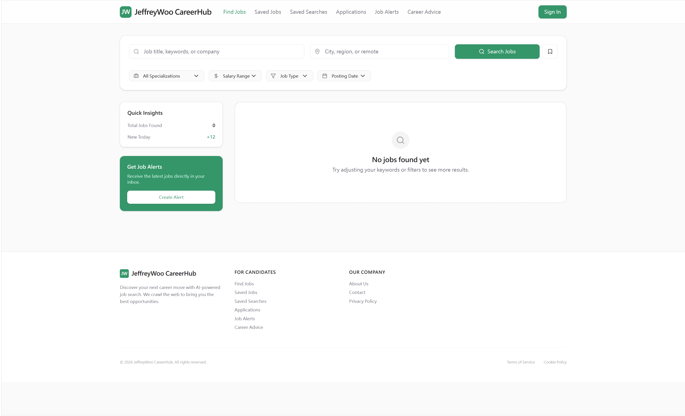 	
   	
   	
   	
  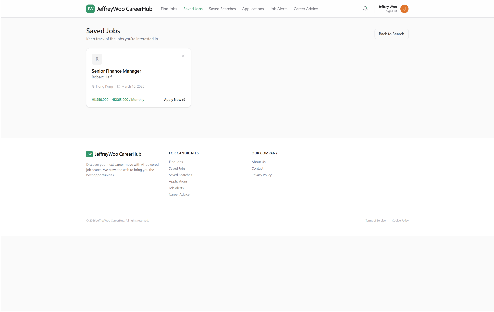 	
  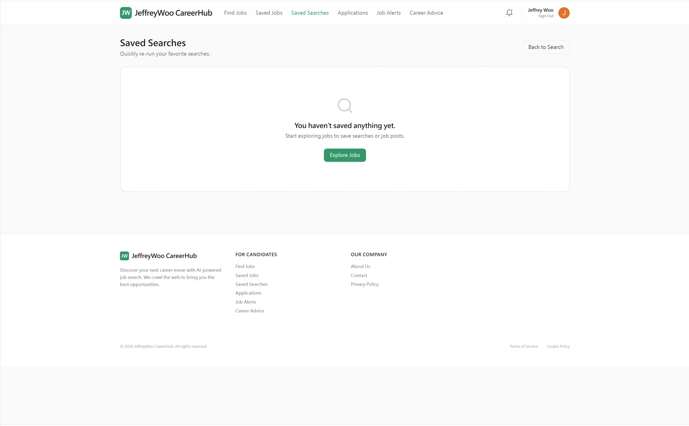 	
   	
  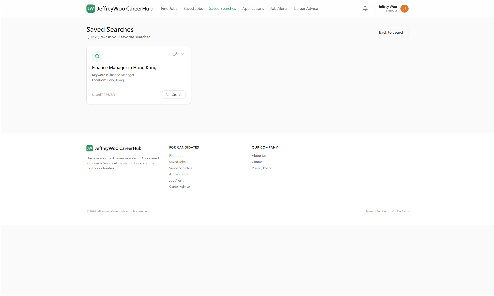 	
  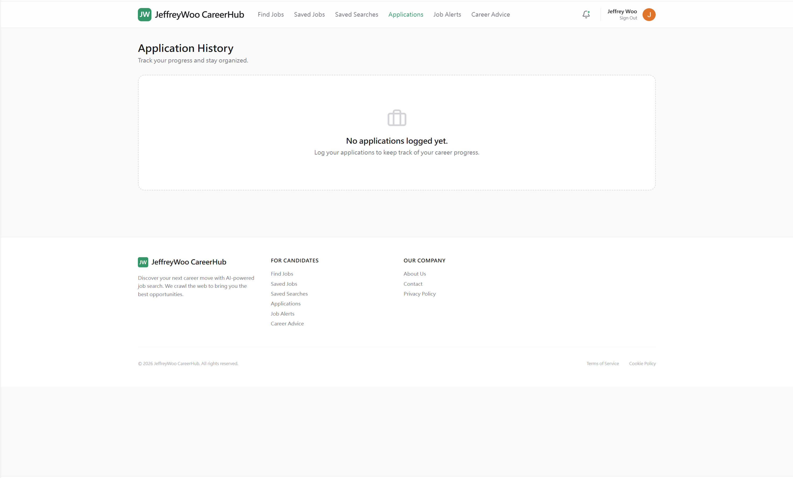 	
   	
   	
   	
  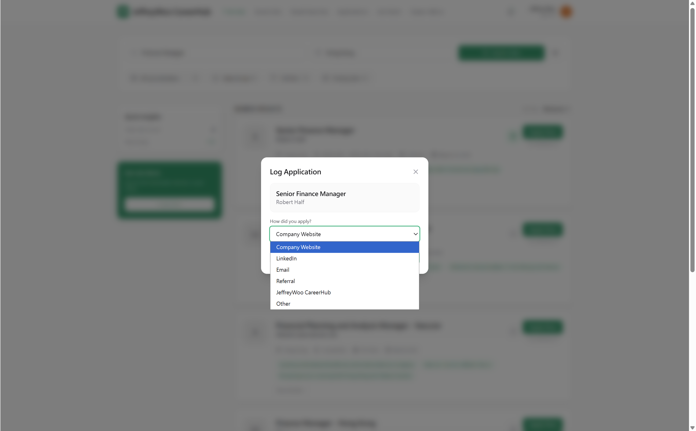 	
  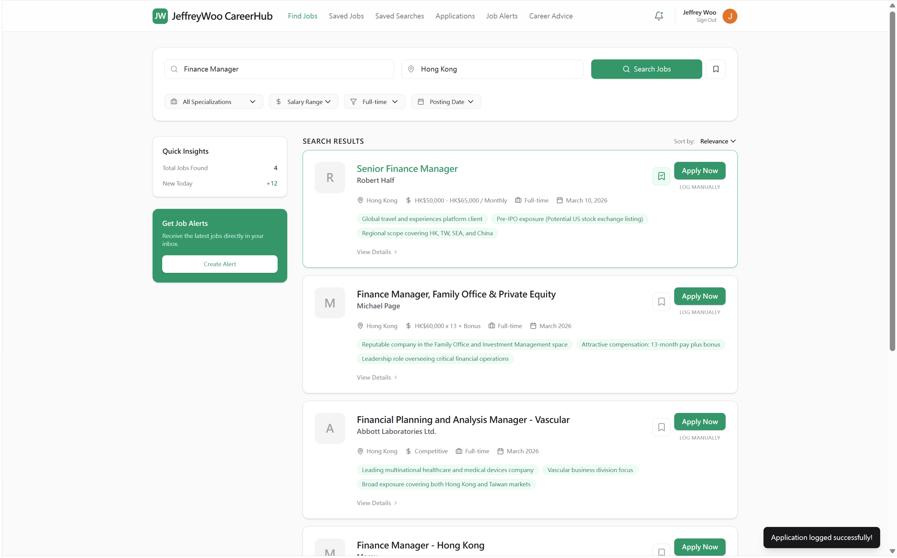 	
  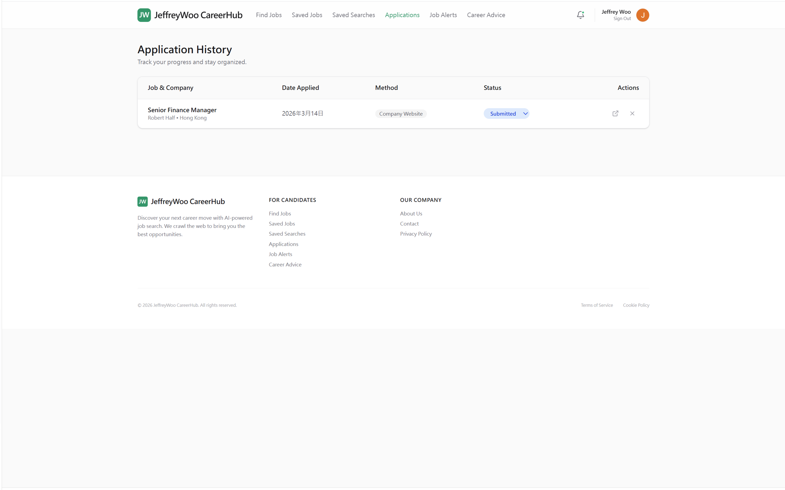 	
  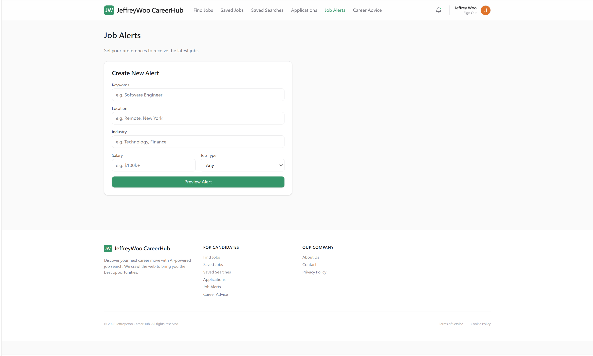 	
  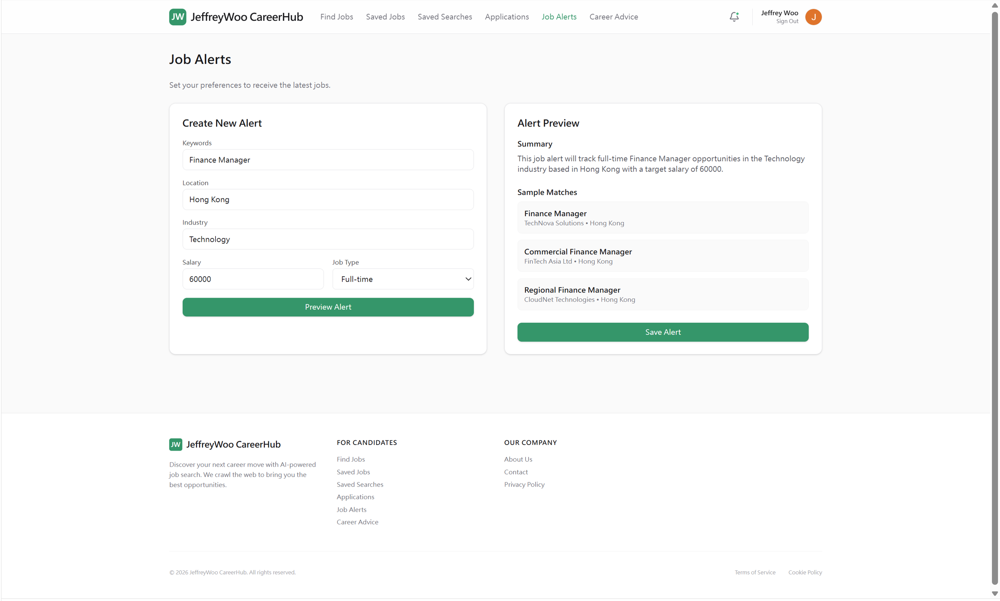 	
   	
  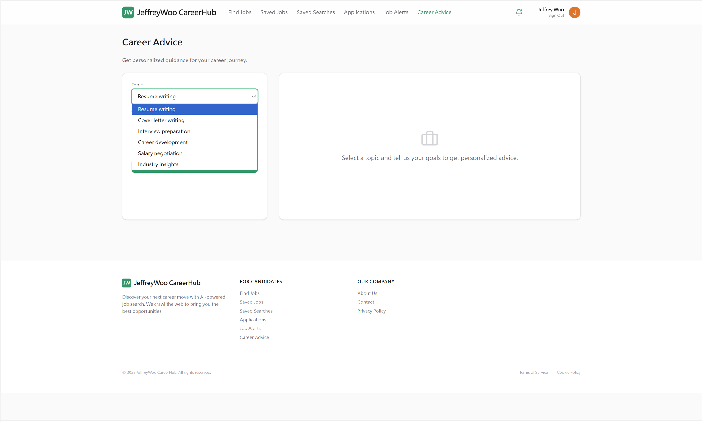 	
   	
   	
   	
   	
   	
   		
